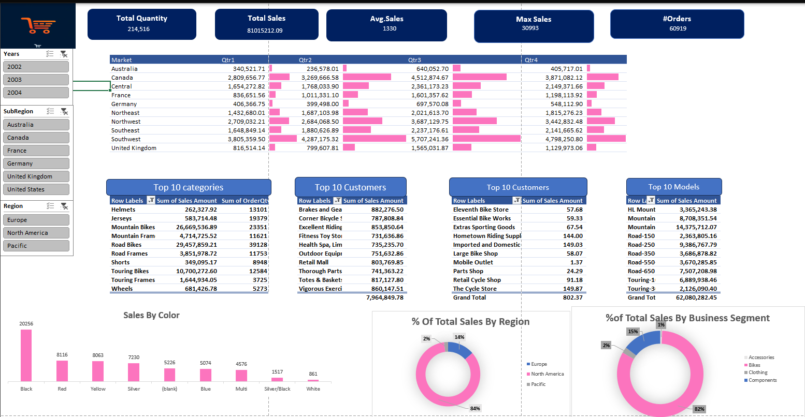

# 📊 Interactive Sales Dashboard (Excel)

## 🧩 Overview

This **Interactive Sales Dashboard** is built using **Microsoft Excel** and offers a comprehensive, visual summary of sales data across different regions, categories, customers, and models. It allows business users, analysts, and managers to make data-driven decisions by slicing and exploring key metrics and trends from 2002 to 2004.

---

## 🌟 Features

- 📅 **Dynamic Filters**:
  - Year, Region, SubRegion slicers
- 📈 **KPIs at a Glance**:
  - Total Quantity Sold
  - Total Sales Value
  - Average Sales per Order
  - Maximum Single Sale
  - Total Orders
- 🛍️ **Sales Analysis**:
  - By Country and Quarter
  - By Product Category
  - By Customer
  - By Product Model
- 🎨 **Product Color Popularity**
- 📊 **Top 10 Listings**:
  - Product Categories
  - Customers
  - Models
- 🍩 **Donut Charts**:
  - % of Total Sales by Region
  - % of Total Sales by Business Segment

---

## 📊 Charts & Visuals

- Bar Chart: Sales by Color
- Embedded Bars: Quarterly Sales per Region
- Donut Charts: Sales share by Region & Business Segment
- Tables: Top Categories, Models, and Customers by Sales
- Slicers: Filter data interactively by Year, Region, and Subregion

---

## 🔍 Insights

- **Black** is the most popular product color, with over 20,000 units sold.
- **Mountain Bikes** dominate both the category and model-level sales.
- **North America** contributes **84%** of the total sales.
- **Retail Cycle Shop** and **Retail Mail** are among the top-performing customers.
- The **Bike** segment accounts for **82%** of all sales.

---

## 🖼️ Screenshot

---

## 📂 How to Use

1. Open the Excel file in **Microsoft Excel 2016 or later**.
2. Use the **slicers on the left panel** to filter:
   - By Year (2002, 2003, 2004)
   - By SubRegion (e.g., France, Canada)
   - By Region (e.g., Europe, Pacific)
3. Hover over or click data elements to explore:
   - Sales performance
   - Trends across quarters
   - Top-performing products and customers

---

## 📌 Requirements

- Microsoft Excel 2016 or later
- No external plugins or macros required
- (Optional) PowerPivot for advanced performance

---

## 🧠 Author Notes

This dashboard was created as an Excel-based Business Intelligence solution for sales performance monitoring and trend analysis. It can be expanded to include forecasting, profit margin analysis, or product return rates.

---

## 📬 Feedback & Contributions

Feel free to suggest improvements or contribute to future versions by submitting a pull request or opening an issue.

---

